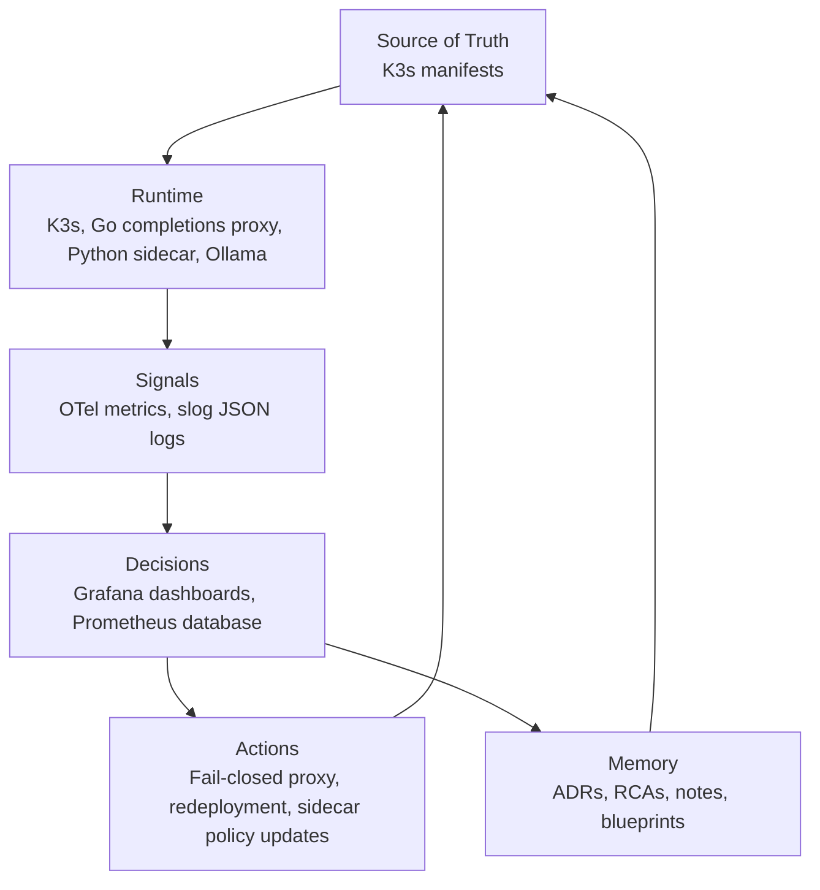

# LLM Telemetry Gateway

LLM Telemetry Gateway is a self-hosted platform engineering lab built with Kubernetes, OpenTelemetry, Prometheus, Grafana, Ollama, Go completions proxy, and Python sidecar.

It proves an end-to-end platform ownership loop: declarative infrastructure runs completions and telemetry services, telemetry exposes pipeline behavior, sidecar policies intercept and mask prompts, and ADRs/RCAs preserve operational memory.

[Full Documentation](./docs/README.md)

---

## Architecture

The main system flow starts from declarative source, runs through host and cluster runtimes, emits telemetry, drives policy intervention, and feeds metrics and logs back into telemetry pipelines.

| Path | Use case | Flow |
| :--- | :--- | :--- |
| Platform reconciliation | Keep host and cluster state aligned with Git | kubectl -> k3s runtime -> gateway namespace |
| Telemetry pipeline | Capture behavior across proxy and policy containers | Go completions proxy -> OpenTelemetry SDK -> OTel Collector -> Prometheus -> Grafana |
| Policy intervention | Intercept prompts, run PII masking, and enforce rules | Go completions proxy -> IPC Unix Domain Socket -> Python policy sidecar -> sanitizer |
| Cognitive Diagnostics | Query LLM model completions and diagnostics | Go completions proxy / Python sidecar -> Ollama API service -> local inference |
| Operational memory | Preserve the reasoning behind decisions and failures | Workflows/incidents -> ADRs/RCAs/notes -> future source changes |



---

## Tech Stack

| Layer | Tools |
| :--- | :--- |
| Language | Go, Python |
| Infrastructure | Kubernetes (k3s), Docker |
| Observability | OpenTelemetry, Prometheus, Grafana |
| Testing | Go `testing` package, Python `pytest` |
| CI/CD | GitHub Actions |

---

## Documentation

- [Architecture](./docs/architecture.md)
- [Observability](./docs/observability.md)
- [GitHub Workflows](./docs/workflows.md)

---

## Local Setup

Compile the Go completions proxy statically:

```bash
make install
make build-go
```

Run checks:

```bash
make test
make lint
make fmt
```

Deploy infrastructure:

For complete bootstrap instructions, cluster configuration, and chaos engineering steps, refer to [k3s/README.md](file:///var/home/victoriac/software/llm-telemetry-gateway/k3s/README.md).
