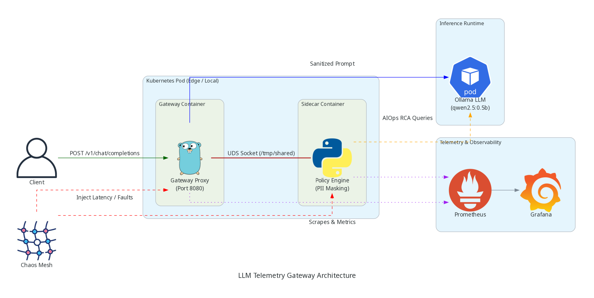

# LLM Telemetry Gateway

LLM Telemetry Gateway is a self-hosted platform engineering lab built with Kubernetes, OpenTelemetry, Prometheus, Grafana, Ollama, Go completions proxy, and Python sidecar.

It proves an end-to-end platform ownership loop: declarative infrastructure runs completions and telemetry services, telemetry exposes pipeline behavior, sidecar policies intercept and mask prompts, and ADRs/RCAs preserve operational memory.

[Full Documentation](./docs/README.md)

---

## Architecture

The system processes requests and manages state through simplified operational paths:

| Path | Purpose | Flow |
| :--- | :--- | :--- |
| Infrastructure Sync | Align cluster and host state declaratively | `kubectl` -> `K3s` runtime |
| Telemetry Pipeline | Capture observability metrics and JSON logs | `Go Proxy` -> `OTel Collector` -> `Prometheus` |
| Policy Masking | Redact PII (SSNs, CCs) from LLM prompts | `Go Proxy` -> `UDS` -> `Python Sidecar` |
| Local Inference | Query LLM completions and execute diagnostics | `Go Proxy` -> `Ollama API` |
| Incident Memory | Document and preserve architectural learnings | `ADRs` / `RCAs` / `Incidents` |



---

## Tech Stack

| Layer | Tools |
| :--- | :--- |
| Language | Go, Python |
| Infrastructure | Kubernetes (k3s), Docker |
| Observability | OpenTelemetry, Prometheus, Grafana |
| Cognitive Diagnostics | Ollama (Qwen 2.5) |
| Chaos Engineering | Chaos Mesh |
| Testing | Go `testing` package, Python `pytest` |
| CI/CD | GitHub Actions |

---

## Documentation

- [Architecture](./docs/architecture.md)
- [Observability](./docs/observability.md)
- [GitHub Workflows](./docs/workflows.md)

---

## Local Setup

### Gateway & Sidecar

Set up the Python policy environment and build the Go completions proxy statically:

```bash
make install   # Setup Python virtualenv and dependencies
make build-go  # Compile static Go gateway binary
```

### Showcase Website Development

Build and run the local documentation and showcase website container with hot-reloading:

```bash
make showcase-build  # Build the development container image
make showcase-run    # Run the container in interactive live-reload mode
make showcase-logs   # Follow live container logs
make showcase-clean  # Stop and clean up the container and image
```

### Quality Verification & Linting

Run automated tests, verification scripts, formatters, and code quality linters:

```bash
make lint      # Run Go, Python, Markdown, and Kubernetes linters
make fmt       # Auto-format all Go, Python, and Markdown files
make test      # Run all Go and Python unit tests
make test-k3s  # Run live in-cluster pod E2E loopback validation
```

### Infrastructure Deployment

Provision the local Kubernetes cluster, run centralized port-forwarding, or clean up resources:

```bash
make bootstrap        # Bootstrap cluster, compile binary, apply manifests, and warm models
make bootstrap-chaos  # Bootstrap cluster with Chaos Mesh installed
make port-forward     # Run centralized port-forwards across all services
make teardown         # Teardown cluster resources and clean up namespaces
```

For detailed architecture, resource limits, and chaos engineering steps, refer to [k3s/README.md](./k3s/README.md).
