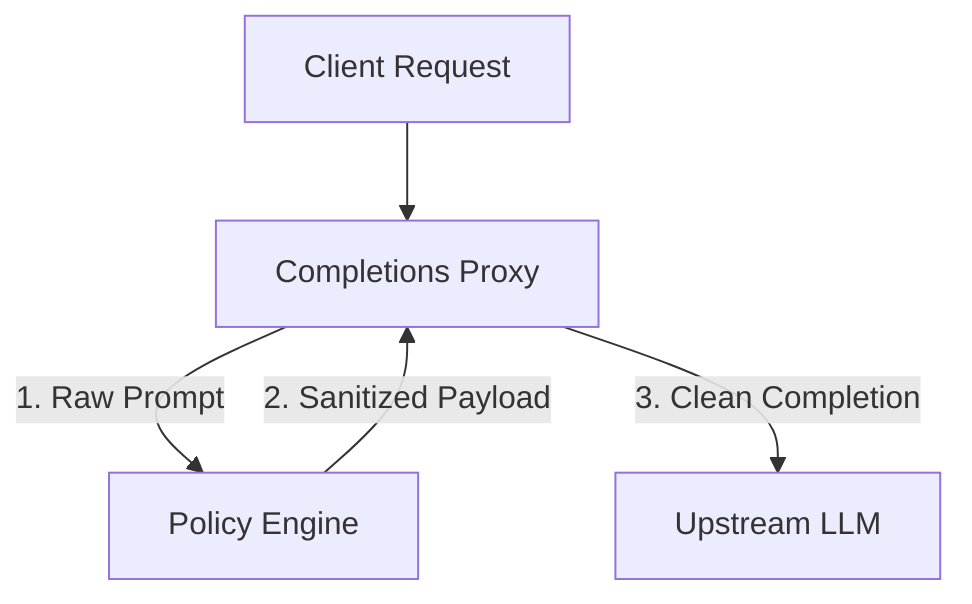

# Architecture Design Document

This document outlines the detailed system design, IPC mechanisms, and lifecycle governance of the LLM Telemetry Gateway.

---

## 🗺️ Architectural Context

The gateway is built to intercept completions traffic directed towards Large Language Models (LLMs), scan and mask sensitive payloads (PII) before transmission, and export granular metrics detailing traffic profile and proxy overhead.

---

## 🔌 Inter-Process Communication (IPC)

To minimize proxy latency overhead, the Go completions proxy and the Python policy sidecar communicate via a UNIX Domain Socket (UDS) located at `/tmp/shared/policy.sock`.

### Why Unix Domain Sockets?

- **Zero-Network Overhead**: Communicating over UDS bypasses the TCP loopback network stack entirely, eliminating kernel syscall overhead and reducing latency to sub-millisecond ranges.
- **Security Boundaries**: UDS communication is restricted to container sharing the same local filesystem namespace. Under our `emptyDir` mount layout, socket access is isolated strictly within the boundary of the individual Pod.

### IPC Protocol

1. **Connection Lifecycle**:
   - The Python sidecar opens and binds to the socket path on startup.
   - The Go gateway acts as the client dialer, establishing a short-lived connection per completion request (configured with connection timeouts of `100ms`).
2. **Payload Design**:
   - Data is exchanged using newline-delimited JSON or raw JSON blocks.
   - Example Input: `{"prompt": "User SSN is 123-45-6789"}`
   - Example Output: `{"prompt": "User SSN is [REDACTED_SSN]"}`

---

## 🚦 Reliability Patterns

To guarantee enterprise-grade resilience, the data plane incorporates two main safety frameworks:

### 1. Fail-Closed Mode

When security policies (like PII masking) are critical, letting an unmasked request pass upstream is an unacceptable compromise.

- **Behavior**: If the UDS connection times out, fails to connect, or returns an invalid status, the Go proxy triggers a **fail-closed** sequence.
- **Resolution**: The proxy aborts the request, blocks it from going to the upstream model, and responds to the client immediately with an `HTTP 503 Service Unavailable` status.

### 2. Kubernetes Readiness Gates

To prevent routing traffic to a proxy instance before its sidecar is functional, the Go application exposes dual health endpoints:

- `/healthz`: Evaluates the liveness of the Go process itself (always returns `200 OK`).
- `/readyz`: Tests connectivity by dialing the sidecar socket `/tmp/shared/policy.sock`. If the socket cannot be dialed within `100ms`, `/readyz` fails with `503 Service Unavailable`, preventing the ingress from routing live traffic to the pod.
