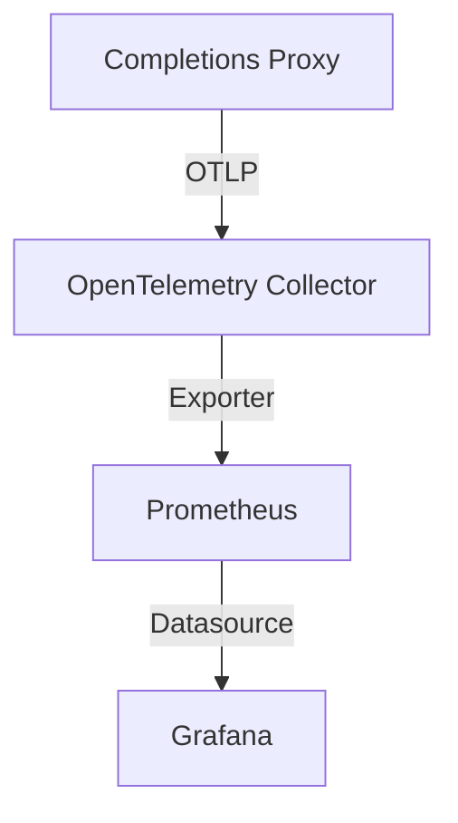

# Observability Design Document

This document outlines the metrics schema, structured log specification, and Grafana dashboard design for the LLM Telemetry Gateway.

---

## 📈 Metric Collection Pipeline

Metric ingestion leverages the OpenTelemetry (OTel) Collector to decouple metric gathering from database export routines:



### Exported Metrics Schema

The Go Completions Proxy exposes the following metric instruments:

| Metric Name | Type | Unit | Description |
| :--- | :--- | :--- | :--- |
| `gen_ai.usage.input_tokens` | Counter | `1` | Cumulative count of input tokens intercepted and processed. |
| `gen_ai.usage.output_tokens` | Counter | `1` | Cumulative count of generated output tokens returned. |
| `gen_ai.client.request.duration_histogram` | Histogram | `s` | Distribution of HTTP round-trip latencies for completions. |

---

## 📝 Structured Logging Schema

Logs are formatted in structured JSON using Go's `slog` library to allow automated parsing by log collectors (such as Promtail, FluentBit, or Logstash).

### Core Fields

Every request log includes the following standard context:

```json
{
  "time": "2026-06-03T08:00:00Z",
  "level": "INFO",
  "msg": "Request completed successfully",
  "duration_seconds": 0.042,
  "input_tokens": 12,
  "output_tokens": 15,
  "status": 200
}
```

Warnings (e.g. readiness failure) capture diagnostic error keys:

```json
{
  "time": "2026-06-03T08:00:02Z",
  "level": "WARN",
  "msg": "Readiness check failed: PII policy engine unreachable",
  "error": "dial unix /tmp/shared/policy.sock: connect: no such file or directory"
}
```

---

## 📊 Grafana Dashboards

System stats (CPU/Memory via Node Exporter) are correlated with application telemetry in a single pre-configured dashboard (`dashboard.json`).

### Core Panel Designs

1. **Completions Latency**: Displays p50, p90, and p99 percentiles of HTTP request processing duration to monitor proxy overhead.
2. **Token Throughput**: Aggregates `input_tokens` and `output_tokens` rates to track total cognitive workload.
3. **Resource Correlation**: Charts Node CPU and memory utilization alongside application throughput, allowing rapid root-cause analysis during performance degradation.
