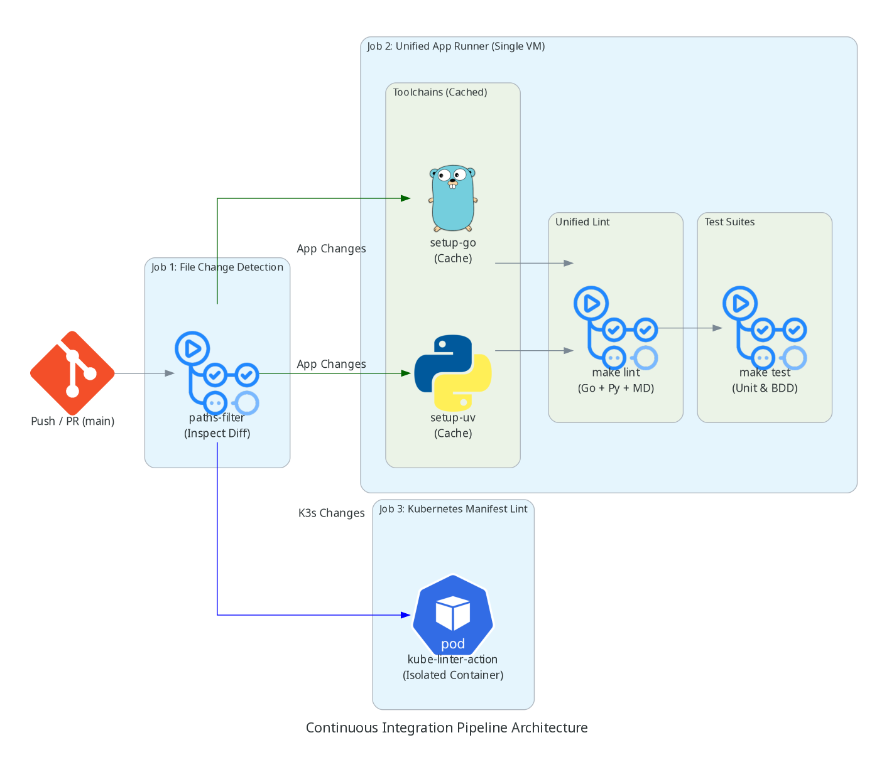

# Platform Workflows

This document details the CI/CD and automation architecture that validates the LLM Telemetry Gateway.

---

## 📂 Pipeline Architecture

The continuous integration pipeline (`.github/workflows/ci.yml`) uses a consolidated runner strategy to eliminate cloud VM provisioning waste, maintain warm toolchain caches, and deliver sub-minute validation feedback.

---

## ⚙️ Core Pipeline Jobs

### 1. 🔍 Detect File Changes

Coordinates conditional execution by inspecting modified paths in the commit diff.

- **Trigger**: Push or Pull Request targeting `main`.
- **Implementation**: Uses `dorny/paths-filter` to evaluate whether Go, Python, Kubernetes manifests, or Markdown files changed.
- **Optimization**: Downstream test jobs only execute if their corresponding file paths were modified.

### 2. 🚀 Unified App Runner (`app-ci`)

Consolidates polyglot application verification into a single, high-performance Ubuntu runner.

- **Trigger**: Changes detected in Go, Python, or Markdown files.
- **Toolchains**:
  - `actions/setup-go`: Pre-warms Go module cache.
  - `astral-sh/setup-uv`: Installs Python runtime and syncs `.venv` via `uv` in milliseconds.
- **Execution Steps**:
  - `make lint`: Unified linting sweep across `go vet`, `ruff check`, and `markdownlint-cli`. Supports targeted positional arguments (e.g. `make lint internal/sidecar/*.py`).
  - `make test-py`: Sidecar unit tests via `pytest`.
  - `make test-go`: Gateway unit tests.
  - `make test-bdd`: Godog BDD end-to-end integration scenarios (`e2e/`).

### 3. 🏗️ Kubernetes Manifest Linting (`k3s-ci`)

Validates Kubernetes configurations, resource limits, and security policies inside `k3s/`.

- **Trigger**: Changes detected in `k3s/**/*.yaml`.
- **Implementation**: Executes `stackrox/kube-linter-action` in an isolated container environment.
- **Enforcement**: Catches missing resource constraints, privileged containers, and namespace policy violations.
